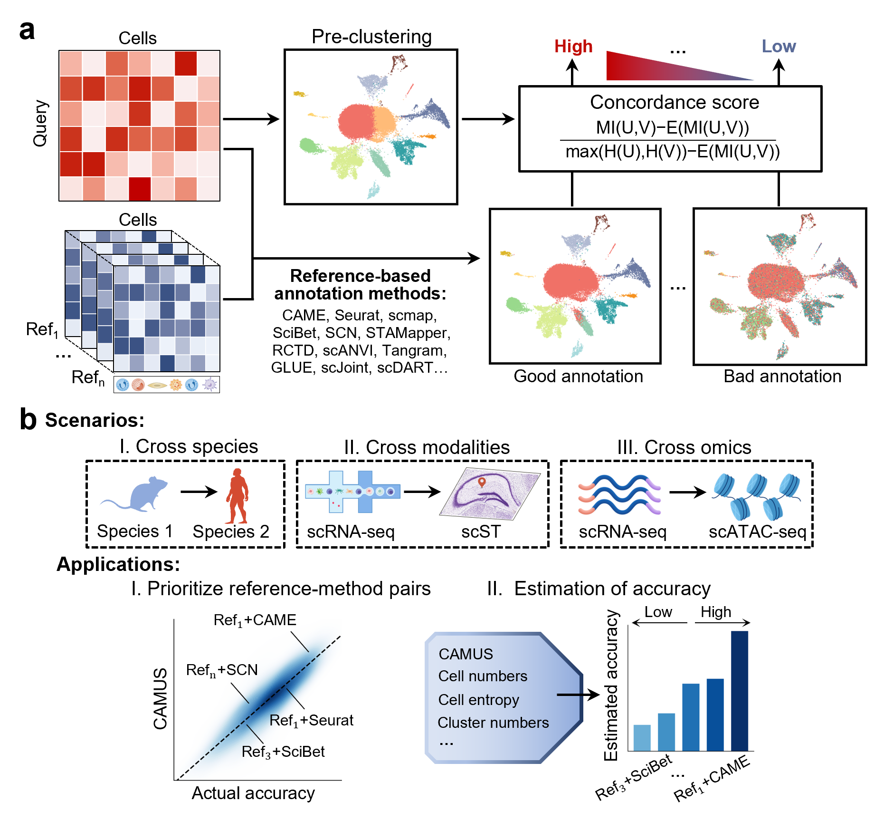

# CAMUS

## Overview
CAMUS (<u>c</u>ross-datasets <u>a</u>nnotation <u>m</u>odeling with <u>u</u>niversal reference data and method <u>s</u>election) is a method that designed for accurately and efficiently selecting references and methods for universal single-cell annotation. It can help users select the best reference-method pairs for reference-based annotation tasks, and estimate the annotation accuracy. Extensive tests on diverse scenarios (e.g., cross-species, cross-modalities, and cross-omics) served as benchmarks to demonstrate superiorities of CAMUS for reference and method selection.

We collected 672 (reference and query) paired cross-species scRNA-seq datasets from seven species and five tissues, served as a benchmark for cross-species annotation. We also provide the homologous relationships between genes from different species as the input for CAME (can be downloaded from [here](https://drive.google.com/drive/u/0/folders/1DpZKJUw-fI34WBVpDOQOSZWP-gRrDPeD)).

We  collected 80 scST (single-cell spatial transcriptomics) datasets and paired scRNA-seq datasets from seven technologies and five tissues, served as a benchmark for cross-modalities annotation (can be downloaded from [here](https://drive.google.com/drive/folders/1xP3Fh94AwKu4OsH3khGq-KEw0VCoiRnL?dmr=1&ec=wgc-drive-globalnav-goto)).

We  collected 5 scATAC-seq datasets and paired scRNA-seq datasets from five different tissues, served as a benchmark for cross-omics annotation (can be downloaded from [here](https://drive.google.com/drive/u/0/folders/1uCrGNXUM_YIyMXrXWqkEvd_dwMfS8-X2)).



## Prerequisites
It is recommended to use a Python version  `3.9`.
* set up conda environment for CAMUS:
```
conda create -n CAMUS python==3.9
```
* activate CAMUS from shell:
```
conda activate CAMUS
```

* the important Python packages used to run the model are as follows: 
```
scanpy>=1.9.1,<=1.9.6
sklearn>=1.3.0,<=1.3.0
autogluon==1.1.0
```

For scATAC-seq query data, the snapATAC2 python packages is also needed:

```
snapatac2==2.6.4
```

## Installation

You can install CAMUS via:
```
git clone https://github.com/zhanglabtools/CAMUS.git
cd CAMUS
python setup.py build
python setup.py install
```

## Tutorials
The following are detailed tutorials, you can find the demo dataset [here](https://drive.google.com/drive/folders/13qNA_2pNMW-0eLwEM2Fc2NEgXfHyUV_X?dmr=1&ec=wgc-drive-globalnav-goto). You can run tutorials 1, 2, and 4 on Windows or Linux system. Tutorial 3 requires Linux as snapATAC2 is only supported on that system. For tutorial 4, the trained AutoGluon model can be downloaded from [here](https://drive.google.com/drive/folders/1PvSwKWwDtFXUV5ghhzs9mIkNljQLqxrA?dmr=1&ec=wgc-drive-globalnav-goto).

1. [(Scenario I) Prioritize reference-method pairs by using CAMUS score on cross-species scRNA-seq dataset)](./Tutorials/(Scenario_I)_Prioritize_reference-method_pairs_by_using_CAMUS_score_on_cross-species_scRNA-seq_dataset.ipynb).
2. [(Scenario II) Prioritize method by using CAMUS score on scST dataset](./Tutorials/(Scenario_II)_Prioritize_method_by_using_CAMUS_score_on_scST_dataset.ipynb).
3. [(Scenario III) Prioritize method by using CAMUS score on scATAC-seq dataset](./Tutorials/(Scenario_III)_Prioritize_method_by_using_CAMUS_score_on_scATAC-seq_dataset.ipynb).
4. [Estimate the annotation accuracy](./Tutorials/Estimate_the_annotation_accuracy.ipynb).
